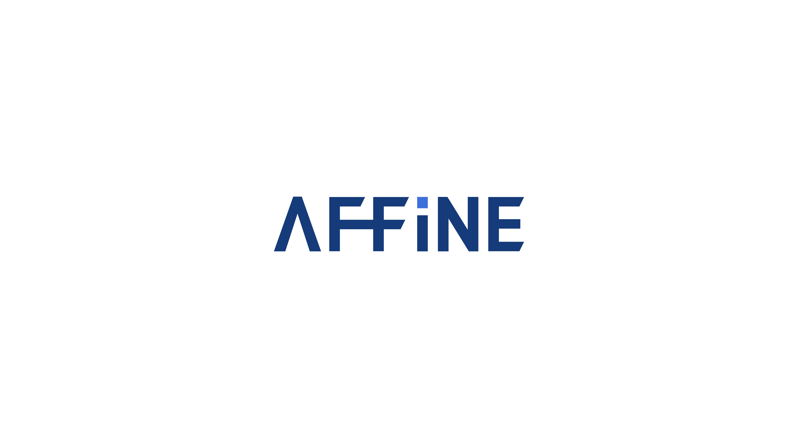
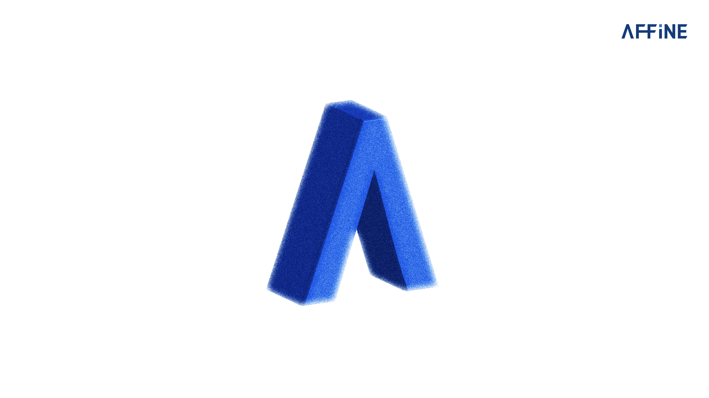
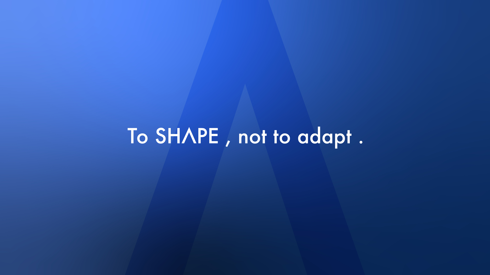
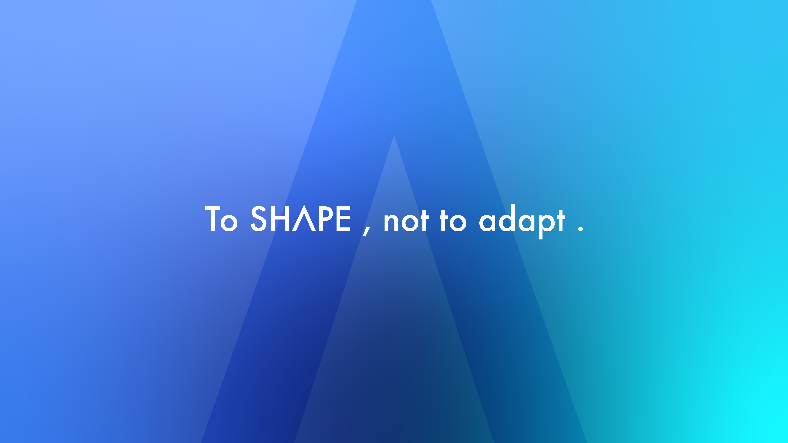
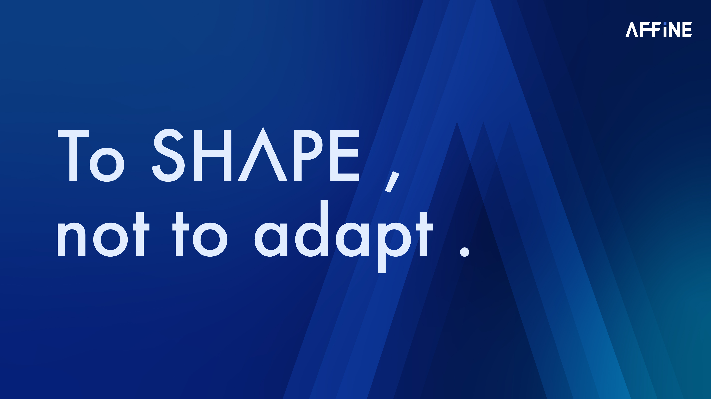
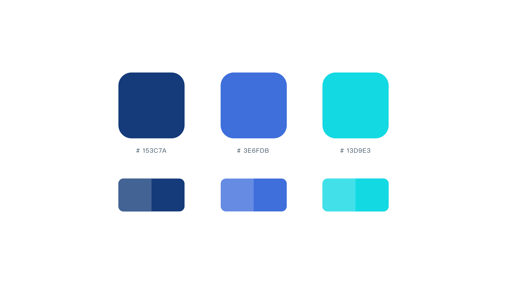
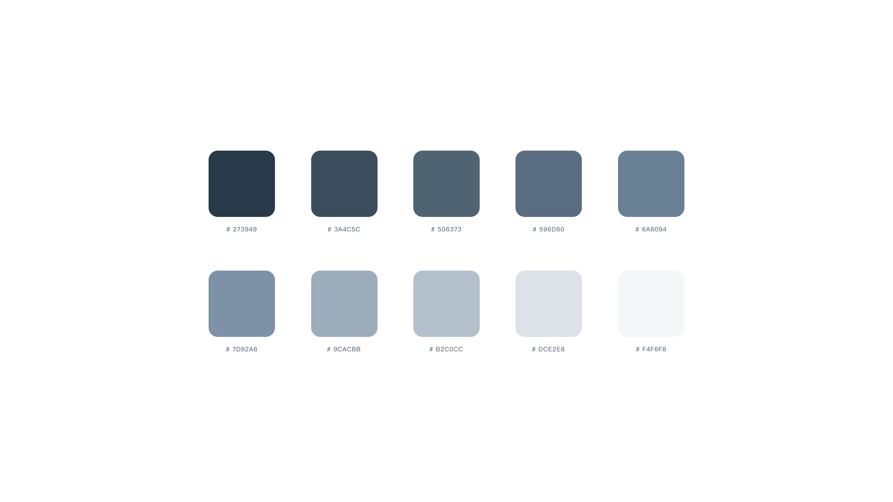

# ™ Branding resources



### Logo (Icon)

<figure><figcaption></figcaption></figure>

 

<figure><figcaption></figcaption></figure>

### Logo (Text)

<figure><figcaption></figcaption></figure>

 

<figure><figcaption></figcaption></figure>

### Logo (3D)

<figure><figcaption></figcaption></figure>

 

<figure><figcaption></figcaption></figure>

 

<figure><figcaption></figcaption></figure>

### Tagline

<figure><figcaption></figcaption></figure>

 

<figure><figcaption></figcaption></figure>

 

<figure><figcaption></figcaption></figure>

 

<figure><figcaption></figcaption></figure>

### Colors

<figure><figcaption></figcaption></figure>

 

<figure><figcaption></figcaption></figure>

