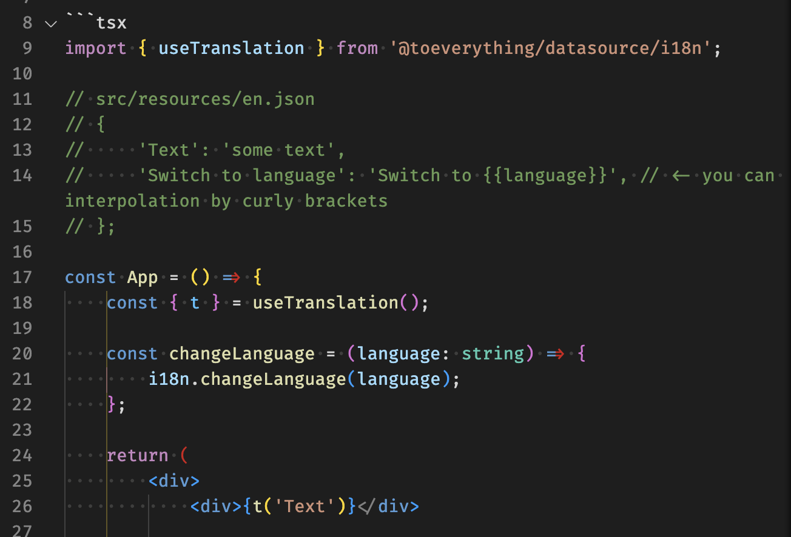

# Internationalization

AFFiNE should be available to everyone everywhere, and we don't want language to be a barrier. So for this reason we have implemented internationalization features into our codebase.

## Setup

First we import the translation API
```
import { useTranslation } from '@toeverything/datasource/i18n';
```

Then we setup our variable (inside our app function)
```
const { t } = useTranslation();
```

<figure><figcaption></figcaption></figure>

##  Updating keys

English is the base language and all other language files will be autogenerated from our i18n platform (when fully translated).
This means it is only necessary to edit the EN language file to add/edit language strings.

The file format is JSON and can be found within the AFFiNE app under the following directory.
```
libs/datasource/i18n/src/resources/en.json
```

<figure><figcaption></figcaption></figure>
