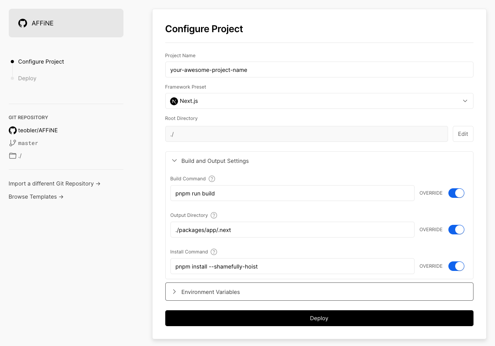
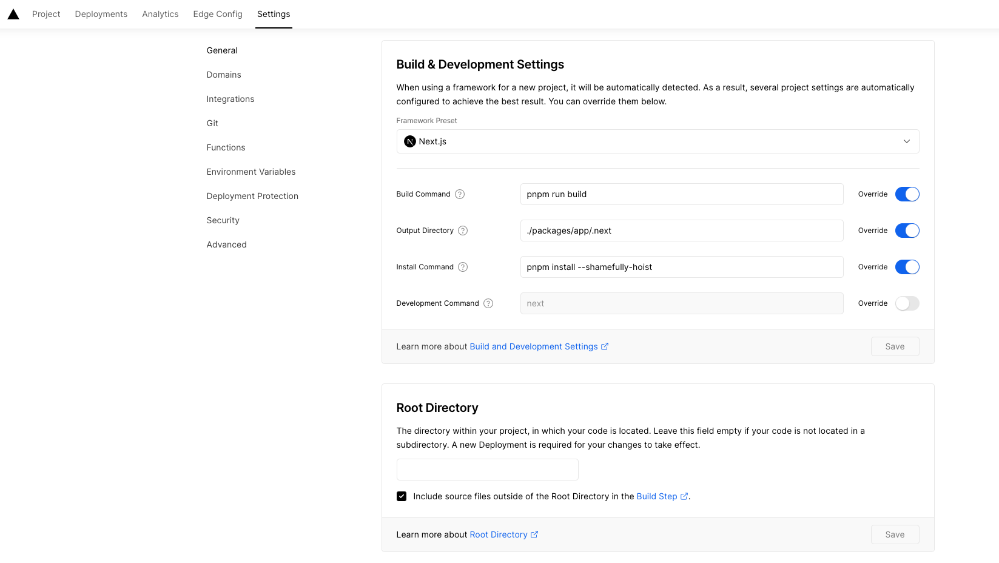

# Deploy AFFiNE to Vercel
[Vercel](https://vercel.com) is a platform for frontend developers, providing the speed and reliability innovators need to create at the moment of inspiration.

`AFFiNE` can be simply deployed to `Vercel` with just a few mouse clicks because `Vercel` fully supports `Next.js`, which is the stack used by `AFFiNE`.

Before we begin, we'll assume you already have a `Vercel` account and have connected it to your `GitHub` account.

1. Fork [AFFiNE](https://github.com/toeverything/AFFiNE) to your onn `GitHub` account.
2. After logging in to [Vercel](https://vercel.com), go to your hobby page and click the `Add New... - Project` button.
3. Click the `Import` button after selecting the AFFINE repository you forked (if you cannot access your repository, go to the Vercel team's [guide](https://vercel.com/docs/concepts/git#deploying-a-git-repository)).
4. Next, configure your project as follows:
    - Build Command - `AFFiNE` uses pnpm to build whole app
    - Output Directory - output of build assets in the app folder
    - Install Command - since we set up `AFFiNE` as a `Next.js` project, `Vercel` will detect `Next.js` dependencies, but the work dir is the root dir, so this is required as `Vercel` will otherwise not find `Next.js` dependencies
<figure><figcaption></figcaption></figure>

5. To deploy `AFFiNE` to a production environment, click `Deploy`.
6. After building is complete, go to the address that `Vercel` provides and enjoy!

## Troubleshooting
If your building fails, go to the project settings page and verify whether your `Root Directory` is accurate.

Sometimes building fails when the `Root Directory` is set to `./` during the initialization of the project.

<figure><figcaption></figcaption></figure>

You can simply leave it empty or set it up using `./` as suggested in the tips.
