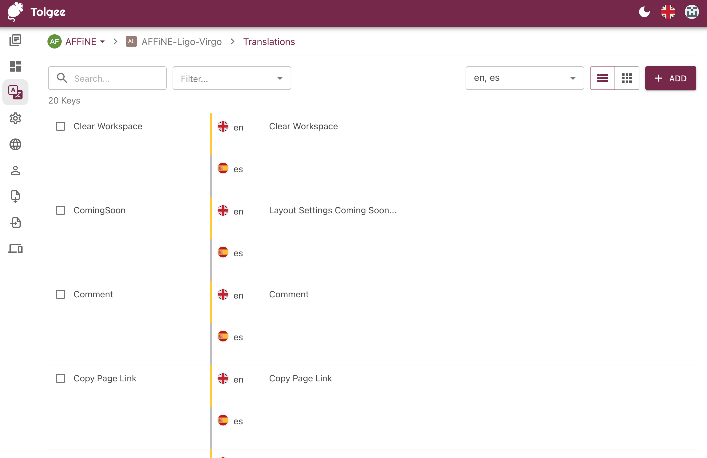
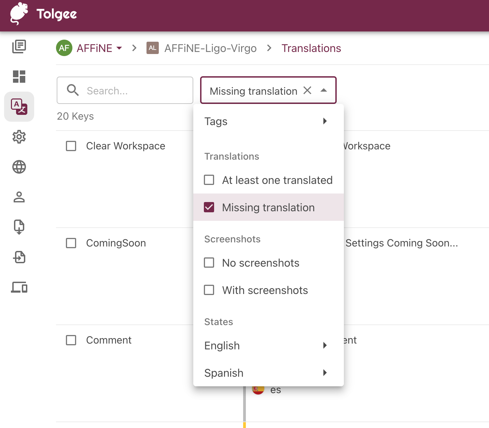
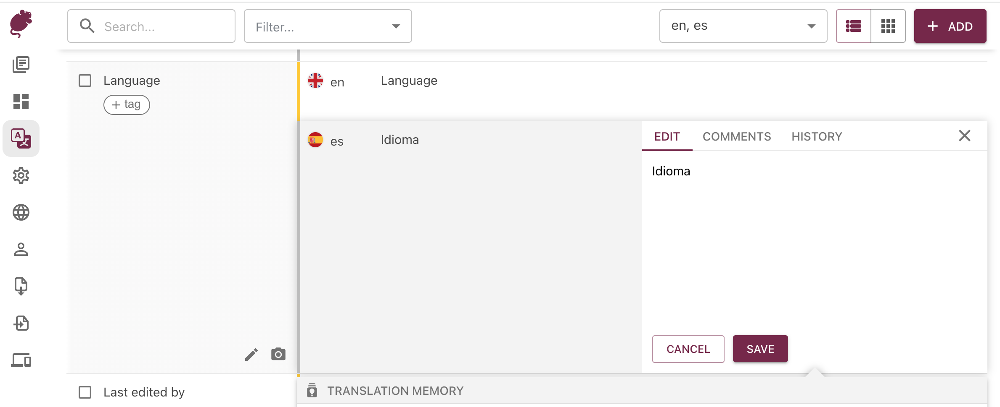

# 📘 Operation Guide

AFFiNE currently uses Tolgee as a translation and localization platform. So, for learning more about them and their platform you can visit the [Tolgee Documentation](https://tolgee.io/docs/).\
\
To get started the first thing you will need to do is login to our internationalization platform. You'll first need to apply, and after reviewing your application we'll send you an invitation link if you have been accepted.

* First head over to our internationalization platform:


[https://i18n.affine.pro/](https://i18n.affine.pro/)


*   When you login you will first see the projects page which will list the available projects of AFFiNE:

    * Ligo-Virgo - these are the codename of the AFFiNE editors which are used in AFFiNE e.g. [https://livedemo.affine.pro/](https://livedemo.affine.pro/)
    * Venus - this is the codename of the AFFiNE website - [https://affine.pro/](https://affine.pro/)

    You may need to contact us if you do not have the permissions to see both of these projects.

<figure><figcaption></figcaption></figure>

* Once you've selected a project you will be taken to the project dashboard. From here you can choose the language you wish to offer localization/translation for.\
  You can choose a language from the list or chose the languages directly from the translations page (accessible from the left navbar)

<figure><figcaption></figcaption></figure>

* On the translation page you can directly being working and translating strings and text.

<figure><figcaption></figcaption></figure>

* You can also filter, to find untranslated strings.

<figure><figcaption></figcaption></figure>

* Once you've done editing/adding a comment. Don't forget to save!

<figure><figcaption></figcaption></figure>

That's it! We thank you for your contributions in helping make AFFiNE available to wider audiences and communities.
